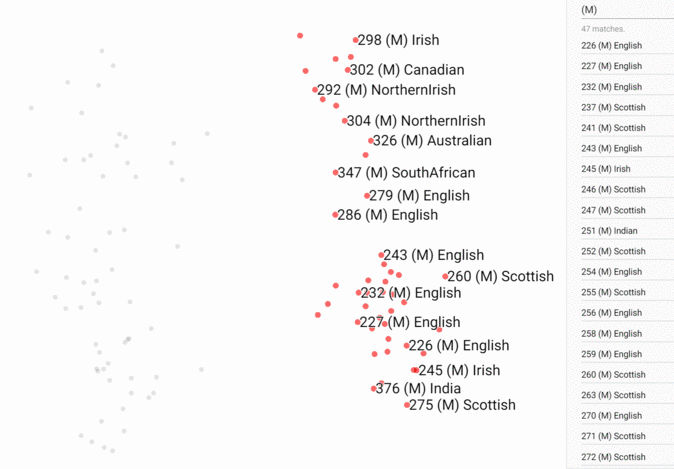
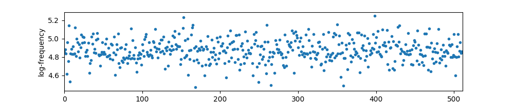

This is an implementation of the VQ-VAE model for voice conversion in [Neural Discrete Representation Learning](https://arxiv.org/abs/1711.00937). 
So far the results are not as impressive as DeepMind's yet (you can find their results [here](https://avdnoord.github.io/homepage/vqvae/)).
My estimate is that the voice quality is 2 - 3 and intelligibility is 3 - 4 (in 5-scaled Mean Opinion Score).
Contributions are welcome.
<br/>
<br/>


# Current Results
## Audio Samples
Results after training for 500k steps (about 2 days):

Source 1: [p227_363](https://drive.google.com/open?id=1y7qJFhv79Rufb82X8b40atQsKFRGOsMC) (We're encouraged by the news)  
Target 1: [converted into p231](https://drive.google.com/open?id=1Ja6y6R6fHpS6IkIry2OYjWBFkHjT-N0V)

Source 2: [p240_341](https://drive.google.com/open?id=10QdyNXm2tUupq0fTm0X94JhC3zwa9etA) (Who was the mystery MP?)  
Target 2: [converted into p227](https://drive.google.com/open?id=14UZl-Fmm1HU2acOSLajpcIA6psk_JxnJ)

Source 3: [p243_359](https://drive.google.com/open?id=1Wgyqc6BOLiZV0JMlmW2Jw4yVst9NfmDb) (Under Alex Ferguson, Aberdeen showed it could be done.)  
Target 3: [converted into p231](https://drive.google.com/open?id=1jtkZ46bmDUzxahILuELU-eoa3l9IEEMf)

Source 4: [p231_430](https://drive.google.com/open?id=1-4A2FEPydp1p8Nu3dPkIvCUK3tvm4oco) (It was a breadtaking moment.)  
Target 4: [converted into p227](https://drive.google.com/open?id=1xOWZuQUdtrsQzUr_wn2PUpIJ_gNkfS7f)

Note: 
1. format: [speaker]_[sentence]
2. the author didn't specify the target speaker on the [demo website](https://avdnoord.github.io/homepage/vqvae/).
<br/>
<br/>


## Speaker Space
  
PCA-2D of the speaker space learned by VQ-VAE (Tensorboard screenshot). 
Note that genders are separated naturally, as pointed out in Fig. 4 of [Deep Voice 2](https://arxiv.org/abs/1705.08947).
Interestingly, the gender of `p280` is not specified in the `speaker-info.txt` file released by VCTK, but according to the figure, we can make a confident guess that `p280` is female.
<br/>
<br/>

### Output Frequency of Exemplars (VQ Centroids)
  
All the exemplars are utilized at about the same order of magnitude of frequency (x-axis represents the index of exemplars).   
<br/>
<br/>

# Dependency
- Ubuntu 16.04
  - ffmpeg
  - Python 3.6
    - Tensorflow 1.5.0  
<br/>
<br/>

# Usage
Create a soft link in the project dir:
```bash
git clone https://github.com/JeremyCCHsu/vqvae-speech.git
cd vqvae-speech
mkdir dataset
cd dataset
wget http://homepages.inf.ed.ac.uk/jyamagis/release/VCTK-Corpus.tar.gz
tar -zxvf VCTK-Corpus.tar.gz
mv VCTK-Corpus VCTK
cd ..

# # Ignore these 2 lines if you already use your env
# conda create -n vqvae -y python=3.6
# source activate vqvae

pip install -r requirements

# Convert wav into mu-law encoded sequence
# The double quotation mark is necessary
# WARNING: without ffmpeg, this script crashes with inf loop
python wav2tfr.py   \
  --fs 16000 \
  --output_dir dataset/VCTK/tfr \
  --speaker_list etc/speakers.tsv \
  --file_pattern "dataset/VCTK/wav48/*/*.wav" 

# [Optional] Generate mu-law encoded wav
python tfr2wav.py \
  --output_dir dataset/VCTK/mulaw \
  --speaker_list etc/speakers.tsv \
  --file_pattern "dataset/VCTK/tfr/*/*.tfr"

# Training script
python main.py \
  --speaker_list etc/speakers.tsv \
  --arch architecture.json \
  --file_pattern "dataset/VCTK/tfr/*/*.tfr" \

# Generation script
# Please specify the logdir argument 
# Please specify e.g. `--period 45` for periodic generation
python generate.py \
  --logdir logdir/train/[dir]
```  
Training usually takes days on a Titan Xp. Progresses are significant during the first 24 hours; the cross-entropy loss saturates at around 1.7 afterwards.  
<br/>
<br/>


# Dataset
The experiement were conducted on CSTR [VCTK corpus](http://homepages.inf.ed.ac.uk/jyamagis/page3/page58/page58.html).
Download it [here](http://homepages.inf.ed.ac.uk/jyamagis/release/VCTK-Corpus.tar.gz).  
Note: 
  1. One of the speakers (`p280`) is missing in VCTK's `speaker-info.txt` file.  
  2. One of the sound files (`p376_295.raw`) isn't  in `wav` format. I simply ignored that file.  
  3. One of the speakers (`p315`) has no accompanying transcriptions, though this doesn't matter in our task. 
<br/>
<br/>


# Misc.
1. The code for generation is naively implemented (not fast WaveNet), so generation is very slow.
2. Exact specifications such as the encoder architecture is not provided in their paper.
3. Whether they use one-hot representation for the wav input is unclear.
4. Initialization of the exemplars are crucial, 
     but how the authors initialized exemplars is unclear.
     I chose exemplars from encoder output because this it least expensive and most reasonable.
     Improper initialization (normal/uniform distribution with wrong variance/range) could end up a detrimental, leading to unused exemplars and reducing speech intelligibility.
5. `dataloader` does not explicitly pad the input because the initial second of each wav file is always silent.  
<br/>


## Reference:
This repo is inspired by [ibab](https://github.com/ibab)'s [WaveNet repo](https://github.com/ibab/tensorflow-wavenet).
